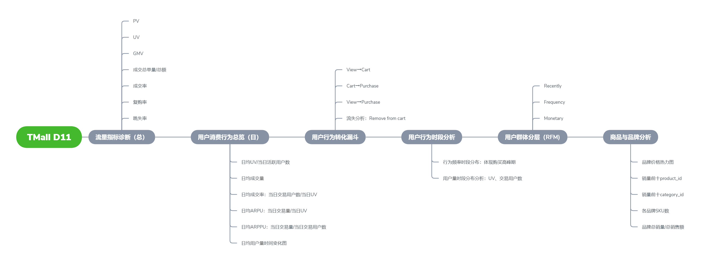

# Sales Data Analysis
**_In-depth Analysis of Online shop cosmetics sales data from Kaggle._**

_Primary Language: `Python`_

_Core file: [Sales_19Dec_overview.ipynb](Sales_19Dec_overview.ipynb)_

_friendly format for scan: [forshare_Sales_19Dec_overview.pdf](forvisit/forshare_Sales_19Dec_overview.pdf)_

_friendly link for scan if rendering slowly or failed here: [open in nbviewer](https://nbviewer.org/github/DingBangBang/Portfolio/blob/main/Portfolio1_sales_EDA/Sales_19Dec_overview.ipynb)_


# RawData
- columns:

|  event_time | event_type | product_id | category_id | category_code | brand | price | user_id | user_session |
| --- | --- | --- | --- | --- | --- | --- | --- | --- |
- time range: Oct. 2019 - Feb. 2020
- total rows: 3,000,000 rows per month * 5 months = 15 million
- Data saved in a separate .csv file every month
- link of this dataset: [Jump to Kaggle url](https://www.kaggle.com/datasets/mkechinov/ecommerce-events-history-in-cosmetics-shop/data)
- description from Kaggle about the datasets
```
This file contains behavior data for 5 months (Oct 2019 – Feb 2020) from a medium cosmetics online store.
Each row in the file represents an event. All events are related to products and users. Each event is like many-to-many relations between products and users.
Data collected by __*Open CDP*__ project. Feel free to use an open source customer data platform.
```

# Mindmap v1.0


# Guidelines v2.0
_Table of Content of core file_
```
1. Preliminary EDA
  1.1.Data Overview
  1.2.Global metrics
    1.2.1.total uv total pv
    1.2.2.total order
    1.2.3.GV
    1.2.4.price
    1.2.5.event type
  1.3.Rawdata Cleaning
2. CUSTOMER ANALYSIS
  2.1.Key Point Indicators KPI
    2.1.1.gross conversion rate
      2.1.1.1.funnel model
    2.1.2.purchase frequency
        2.1.2.1.requency distribution diagram
    2.1.3.repurchase rate
    2.1.4.churn cate
  2.2.Customer Lifetime Value LTV
    2.2.1.Total LTV
    2.2.2.Precised LTV by RFM Model
      2.2.2.1.histplot of RFM distribution
  2.3.User Segmentation
    2.3.1.User Tags Distribution BarChart
3. PLATFORM ANALYSIS
  3.1.User Engagement
    3.1.1.daily engagement of platform
    3.1.2.hourly engagement of platform
  3.2.Conversion Rate in Finer Granularity
    3.2.1.total conversion rate
    3.2.2.level conversion rate
  3.3.Retention Rate
  3.4.User Stickiness
4. BRAND AND PRODUCT ANALYSIS
  4.1.Performance of Brands
    4.1.1.highest-heat brand
    4.1.2.outstanding brands
    4.1.3.Problematic brands
  4.2.Performance of Products
5. SUMMARY
```
