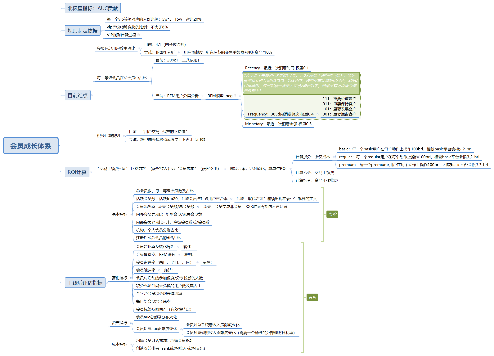

# Portfolio_KA_dashboard
_**Analysis of KA data from multiple dimensions including transactions, profits, engagement, RFM scores, and reviews by SQL, Grafana.**_

_Primary Language: `SQL`_

_Core File: [ka_dashboard_sql.sql](./ka_dashboard_sql.sql)_

# `Grafana`
a toB open-source analytics and visualization platform that allows you to query, visualize, alert on, and understand your metrics no matter where they are stored. It provides a flexible and user-friendly interface for creating and sharing interactive dashboards, enabling users to effectively monitor and analyze data from multiple sources in real-time.

[Grafana Official Website](https://grafana.com/) 

# General guideline of dashboard_v2
<kbd>

</kbd>

# General guideline of hirarchy_v2

