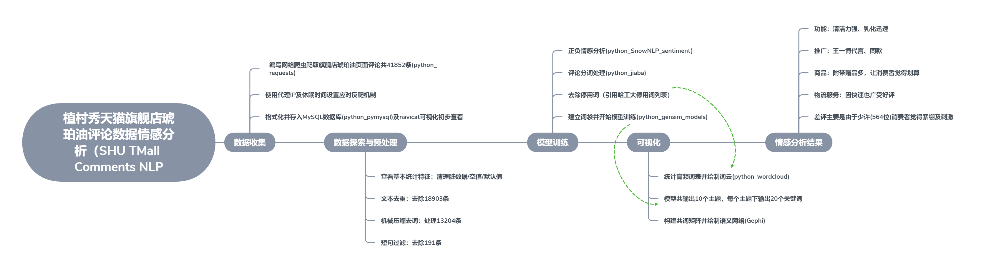

# Portfolio5_comments_NLP
_**A complete process of collecting data from spiders of online webpages to accomplish preliminary Natural Language Processing by topical docu clustering model.**_

_Primary Language: `Python`, `HTML`, `css`_

_Core File: [SHU_comments_NLP.py](Portfolio5_comments_NLP/thesis_project/SHU_comments_NLP.py)_

# Sentiment Analysis Mindmap
_general guideline when dealing with text_

